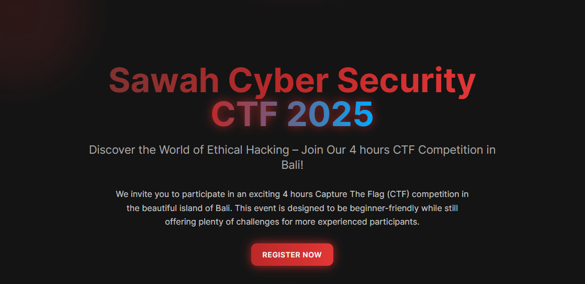

# Sawah Cyber Security CTF 2025 — Landing Page (React rebuild)

A rebuild of the Sawah Cyber Security CTF 2025 landing page on a component-based stack, replacing the original single-file version.



## Why a second version

The [original page](https://github.com/GianneAngely/ctf-landing-page) was a single `index.html` holding all the markup, styles, and scripts. It worked, but editing one section meant scrolling through thousands of lines. This version splits the page into components so each section can be changed independently, and adds a dark theme with an animated matrix background.

## Components

- `HeroSection` with the event pitch
- `CountdownTimer` counting down to the competition
- `AboutSection`, `CategoriesSection`, `EventDetailsSection`
- `PartnersSection` for sponsors and academic partners
- `FAQSection`
- `Navigation` and `Footer`
- `MatrixBackground` for the falling-code effect behind the hero

## Built with

- **Vite** for the dev server and build
- **React** with **TypeScript**
- **Tailwind CSS** for styling
- **shadcn/ui** for the base components
- **AOS** for scroll-triggered animations

## Requirements

Node.js 18 or newer.

## Running it locally

```bash
npm install
npm run dev
```

The dev server prints a local URL, usually `http://localhost:5173`.

To produce a production build:

```bash
npm run build
```

The output lands in `dist/`.

## Docker

The repository includes a `Dockerfile` and an `nginx.conf`, so the static bundle can also be served from a container:

```bash
docker build -t scs-ctf-landing .
docker run -p 8080:80 scs-ctf-landing
```

Then visit `http://localhost:8080`.
